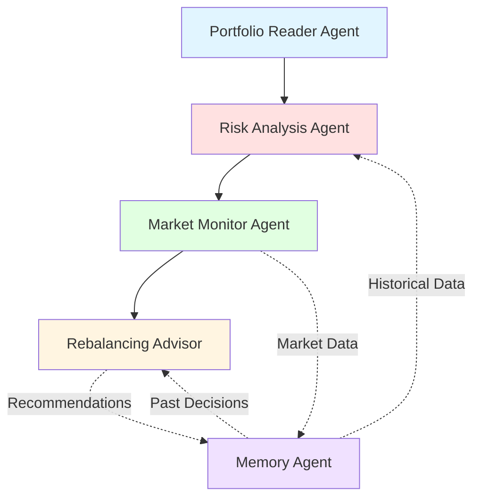

# Barista AI - Portfolio Risk Management & Advisor Agent

An intelligent multi-agent AI system for portfolio risk analysis and investment advisory using LLM-powered reasoning, financial models, and real-time market data.

## 🎯 Overview

Barista AI is a sophisticated portfolio management system that leverages multiple specialized AI agents to provide comprehensive risk analysis, market monitoring, and personalized investment recommendations. The system combines traditional financial models with modern LLM capabilities to deliver actionable insights for risk-aware investment decisions.

## 🏗️ Architecture



## 🤖 Multi-Agent System

### 1. **Portfolio Reader Agent**
- Imports and parses CSV/Excel portfolio data
- Validates asset holdings and transactions
- Normalizes data formats
- Supports multiple portfolio structures

### 2. **Risk Analysis Agent**
- **Value-at-Risk (VaR)**: Parametric, Historical, Monte Carlo methods
- **Beta**: Market sensitivity analysis
- **Sharpe Ratio**: Risk-adjusted return metrics
- **Volatility**: Standard deviation and variance
- **Drawdowns**: Peak-to-trough analysis
- **Correlation**: Asset correlation matrices

### 3. **Market Monitor Agent**
- Real-time price tracking via market APIs
- Multi-asset support (stocks, crypto, bonds, commodities)
- Price alerts and significant movement detection
- Market data caching and rate limiting
- Async data fetching for performance

### 4. **Rebalancing Advisor**
- Asset allocation optimization using Modern Portfolio Theory
- Risk profile matching (conservative, moderate, aggressive)
- Personalized rebalancing strategies
- Tax-loss harvesting considerations
- LLM-powered reasoning for recommendations

### 5. **Memory Agent**
- Historical portfolio performance tracking
- Decision logging and rationale storage
- Trend analysis and pattern recognition
- Vector database integration for RAG
- Continuous learning from past recommendations

## 🚀 Features

- ✅ **Comprehensive Risk Metrics**: VaR, Beta, Sharpe Ratio, Volatility, Drawdowns
- ✅ **Real-time Market Data**: Integration with yfinance, Alpha Vantage, Polygon
- ✅ **Multi-Asset Support**: Equities, bonds, crypto, gold, alternatives
- ✅ **Intelligent Rebalancing**: AI-powered allocation strategies
- ✅ **Historical Memory**: Long-term performance tracking and learning
- ✅ **LLM-Powered Insights**: Natural language explanations and reasoning
- ✅ **Modular Architecture**: Extensible agent-based design
- ✅ **Production-Ready**: Type hints, error handling, comprehensive tests

## 🛠️ Technology Stack

- **AI/LLM**: LangChain, OpenAI, Anthropic Claude
- **Financial Data**: yfinance, Alpha Vantage, Polygon.io
- **Data Processing**: Pandas, NumPy, SciPy
- **Vector Database**: ChromaDB, Pinecone
- **Visualization**: Plotly, Matplotlib, Seaborn
- **Web Framework**: FastAPI, Uvicorn
- **Testing**: Pytest, pytest-asyncio

## 📦 Installation

### Prerequisites
- Python 3.9+
- pip or conda
- API keys for market data providers
- OpenAI or Anthropic API key

### Setup

1. **Clone the repository**
```bash
git clone https://github.com/tarun89034/barista-ai.git
cd barista-ai
```

2. **Create virtual environment**
```bash
python -m venv venv
source venv/bin/activate  # On Windows: venv\Scripts\activate
```

3. **Install dependencies**
```bash
pip install -r requirements.txt
```

4. **Configure environment variables**
```bash
cp .env.example .env
# Edit .env with your API keys
```

5. **Initialize database**
```bash
python scripts/setup_db.py
```

## 🎮 Quick Start

### Analyze Your Portfolio

```python
from src.main import BaristaAI

# Initialize the system
barista = BaristaAI()

# Load portfolio
portfolio = barista.load_portfolio("data/sample_portfolio.csv")

# Run complete analysis
results = barista.analyze(portfolio)

# Display risk metrics
print(f"Portfolio VaR (95%): ${results.var_95:.2f}")
print(f"Sharpe Ratio: {results.sharpe_ratio:.2f}")
print(f"Beta: {results.beta:.2f}")

# Get rebalancing recommendations
recommendations = barista.get_rebalancing_advice(portfolio, risk_profile="moderate")
print(recommendations)
```

### CLI Usage

```bash
# Analyze a portfolio
python src/main.py analyze --portfolio data/my_portfolio.csv

# Monitor market in real-time
python src/main.py monitor --symbols AAPL,MSFT,BTC-USD

# Get rebalancing advice
python src/main.py rebalance --portfolio data/my_portfolio.csv --risk-profile moderate
```

## 📊 Sample Portfolio Format

Create a CSV file with the following structure:

```csv
Symbol,Name,Quantity,Purchase Price,Purchase Date,Asset Type,Sector
AAPL,Apple Inc.,50,150.00,2023-01-15,Equity,Technology
MSFT,Microsoft Corporation,30,300.00,2023-02-20,Equity,Technology
BTC-USD,Bitcoin,0.5,45000.00,2023-04-05,Crypto,Cryptocurrency
GLD,SPDR Gold Trust,100,180.00,2023-05-12,Commodity,Gold
```

## 📚 Documentation

- [Architecture Overview](docs/architecture.md)
- [Agent Documentation](docs/agents.md)
- [Getting Started Guide](docs/getting_started.md)
- [API Reference](docs/api_reference.md)

## 🧪 Testing

Run the test suite:

```bash
# Run all tests
pytest

# Run with coverage
pytest --cov=src tests/

# Run specific test
pytest tests/test_agents/test_risk_analyzer.py
```

## 🤝 Contributing

We welcome contributions! Please see [CONTRIBUTING.md](CONTRIBUTING.md) for guidelines.

1. Fork the repository
2. Create a feature branch (`git checkout -b feature/amazing-feature`)
3. Commit your changes (`git commit -m 'Add amazing feature'`)
4. Push to the branch (`git push origin feature/amazing-feature`)
5. Open a Pull Request

## 📄 License

This project is licensed under the MIT License - see the [LICENSE](LICENSE) file for details.

## 🙏 Acknowledgments

- Modern Portfolio Theory and risk metrics implementations
- Open-source financial data providers
- LangChain and LLM communities

## 📧 Contact

**Tarun** - [@tarun89034](https://github.com/tarun89034)

**Project Link**: [https://github.com/tarun89034/barista-ai](https://github.com/tarun89034/barista-ai)

---

⭐ **Star this repo** if you find it helpful!

Built with ❤️ using AI agents and financial expertise.