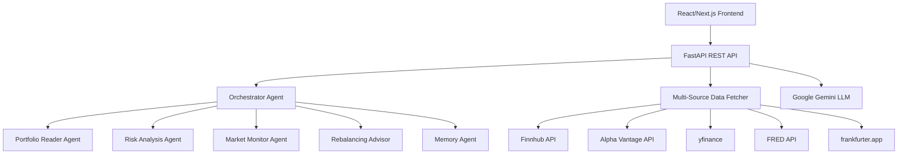

# Barista AI - Portfolio Risk Management & Advisor Agent

An intelligent multi-agent AI system for portfolio risk analysis and investment advisory using Google Gemini, real-time financial data from multiple sources, and a modern React dashboard.

**Live Demo**: [Barista AI on HuggingFace Spaces](https://huggingface.co/spaces/ty8890/barista-ai)

## Overview

Barista AI is a full-stack portfolio management system that leverages multiple specialized AI agents to provide comprehensive risk analysis, market monitoring, and personalized investment recommendations. The system combines traditional financial models (VaR, Monte Carlo, Sharpe/Sortino ratios) with Google Gemini LLM capabilities to deliver actionable insights for risk-aware investment decisions.

### Key Highlights

- **Multi-source data fetching** with fallback chain: Finnhub -> Alpha Vantage -> yfinance
- **Batch downloads** for maximum performance (15 assets in a single API call)
- **Global market coverage** including US, European, Asian, and Indian markets
- **Real-time currency conversion** via frankfurter.app
- **FRED macro indicators** (Fed Funds Rate, Treasury yields, CPI, VIX, etc.)
- **Google Gemini LLM** for natural language portfolio insights

## Architecture


```mermaid
graph TB
    FE[React/Next.js Frontend] --> API[FastAPI REST API]
    API --> OR[Orchestrator Agent]
    OR --> PR[Portfolio Reader Agent]
    OR --> RA[Risk Analysis Agent]
    OR --> MM[Market Monitor Agent]
    OR --> RB[Rebalancing Advisor]
    OR --> MA[Memory Agent]
    API --> DF[Multi-Source Data Fetcher]
    DF --> FH[Finnhub API]
    DF --> AV[Alpha Vantage API]
    DF --> YF[yfinance]
    DF --> FR[FRED API]
    DF --> CX[frankfurter.app]
    API --> LLM[Google Gemini LLM]
```

## Multi-Agent System

### 1. Portfolio Reader Agent
- Imports and parses CSV/Excel portfolio data
- Validates asset holdings and normalizes formats
- Enriches with live prices via batch download

### 2. Risk Analysis Agent
- **Value-at-Risk (VaR)**: Parametric, Historical, Monte Carlo methods
- **Sharpe & Sortino Ratios**: Risk-adjusted return metrics
- **Volatility**: Annualized standard deviation
- **Maximum Drawdown**: Peak-to-trough analysis
- **CVaR / Expected Shortfall**: Tail risk measurement
- **Correlation Matrix**: Asset correlation analysis

### 3. Market Monitor Agent
- Batch real-time price tracking for all portfolio assets
- Price change alerts with severity levels (Low/Medium/High/Critical)
- Market conditions assessment (gainers/losers)

### 4. Rebalancing Advisor
- Risk profile matching (conservative, moderate, aggressive)
- Drift detection and rebalancing recommendations
- Sector and asset-type allocation analysis
- LLM-powered reasoning for recommendations

### 5. Memory Agent
- In-memory portfolio performance tracking
- Decision logging and analysis history

## Technology Stack

| Layer | Technology |
|---|---|
| **Frontend** | React 18, Next.js 14 (static export), Tailwind CSS, Recharts, Framer Motion |
| **Backend** | Python 3.11, FastAPI, Uvicorn, Pydantic v2 |
| **AI/LLM** | Google Gemini (gemini-2.0-flash) |
| **Data** | yfinance, Finnhub API, Alpha Vantage API, FRED API, frankfurter.app |
| **Computation** | NumPy, Pandas, SciPy (Monte Carlo, VaR, correlation) |
| **Deployment** | Docker (multi-stage), HuggingFace Spaces |

## Performance

All data fetching is optimized with batch downloads and parallel execution:

| Endpoint | Latency | Method |
|---|---|---|
| Portfolio Load (15 assets) | ~5-7s | Batch `yf.download()` |
| Global Indices (11 indices) | ~0.6s | Single batch download |
| Indian Market (12 tickers) | ~1.2s | Single batch download |
| Macro Indicators (8 series) | ~0.3s | Parallel ThreadPoolExecutor |
| Risk Analysis | ~0.2s | Batch returns + vectorized Monte Carlo |
| Market Analysis | ~0.2s | Cached batch prices |

## Quick Start

### Prerequisites
- Python 3.9+
- Node.js 18+ (for frontend build)
- API keys: Google Gemini (required), Finnhub, Alpha Vantage, FRED (optional)

### Setup

```bash
# Clone the repository
git clone https://github.com/tarun89034/barista-ai.git
cd barista-ai

# Option 1: Quick start (auto-setup)
chmod +x start.sh && ./start.sh

# Option 2: Manual setup
python -m venv venv
source venv/bin/activate  # Windows: venv\Scripts\activate
pip install -r requirements.txt

# Configure environment
cp .env.example .env
# Edit .env with your API keys (at minimum: GEMINI_API_KEY)

# Build frontend
cd frontend && npm ci && npm run build && cd ..

# Start server
python main.py serve
```

The app will be available at `http://localhost:8000`.

### Environment Variables

| Variable | Required | Description |
|---|---|---|
| `GEMINI_API_KEY` | Yes | Google Gemini API key |
| `FINNHUB_API_KEY` | No | Finnhub API key (fallback source 1) |
| `ALPHA_VANTAGE_API_KEY` | No | Alpha Vantage API key (fallback source 2) |
| `FRED_API_KEY` | No | FRED API key (macro indicators) |
| `API_PORT` | No | Server port (default: 8000, HF Spaces: 7860) |

### CLI Usage

```bash
# Start API server
python main.py serve --host 0.0.0.0 --port 8000

# Run full analysis on a portfolio
python main.py analyze --file data/sample_portfolio.csv --period 1y

# Run risk analysis only
python main.py risk --file data/sample_portfolio.csv

# Monitor market prices
python main.py monitor --file data/sample_portfolio.csv

# Get rebalancing advice
python main.py rebalance --file data/sample_portfolio.csv --profile moderate
```

## Sample Portfolio Format

```csv
Symbol,Name,Quantity,Purchase_Price,Purchase_Date,Asset_Type,Sector
AAPL,Apple Inc.,50,150.00,2023-01-15,Equity,Technology
MSFT,Microsoft Corporation,30,300.00,2023-02-20,Equity,Technology
GOOGL,Alphabet Inc.,20,2800.00,2023-03-10,Equity,Technology
BTC-USD,Bitcoin,0.5,45000.00,2023-04-05,Crypto,Cryptocurrency
GLD,SPDR Gold Trust,100,180.00,2023-05-12,Commodity,Precious Metals
```

## API Endpoints

| Method | Endpoint | Description |
|---|---|---|
| `POST` | `/api/v1/portfolios/load-sample` | Load sample portfolio |
| `GET` | `/api/v1/analysis/risk` | Run risk analysis |
| `GET` | `/api/v1/analysis/market` | Market analysis |
| `GET` | `/api/v1/analysis/rebalancing` | Rebalancing recommendations |
| `GET` | `/api/v1/market/global` | Global market indices |
| `GET` | `/api/v1/market/indian` | Indian market data |
| `GET` | `/api/v1/market/macro` | FRED macro indicators |
| `GET` | `/api/v1/currency/rates` | Exchange rates |
| `POST` | `/api/v1/currency/convert` | Currency conversion |

Full API documentation available at `/docs` (Swagger UI) when the server is running.

## Deployment

### HuggingFace Spaces (Docker)

The project includes a multi-stage Dockerfile that builds the frontend and serves everything from a single container:

```bash
docker build -t barista-ai .
docker run -p 7860:7860 -e GEMINI_API_KEY=your_key barista-ai
```

On HuggingFace Spaces, set your API keys as Space Secrets.

## License

This project is licensed under the MIT License - see the [LICENSE](LICENSE) file for details.

## Contact

**Tarun** - [@tarun89034](https://github.com/tarun89034)

**Project Link**: [https://github.com/tarun89034/barista-ai](https://github.com/tarun89034/barista-ai)
